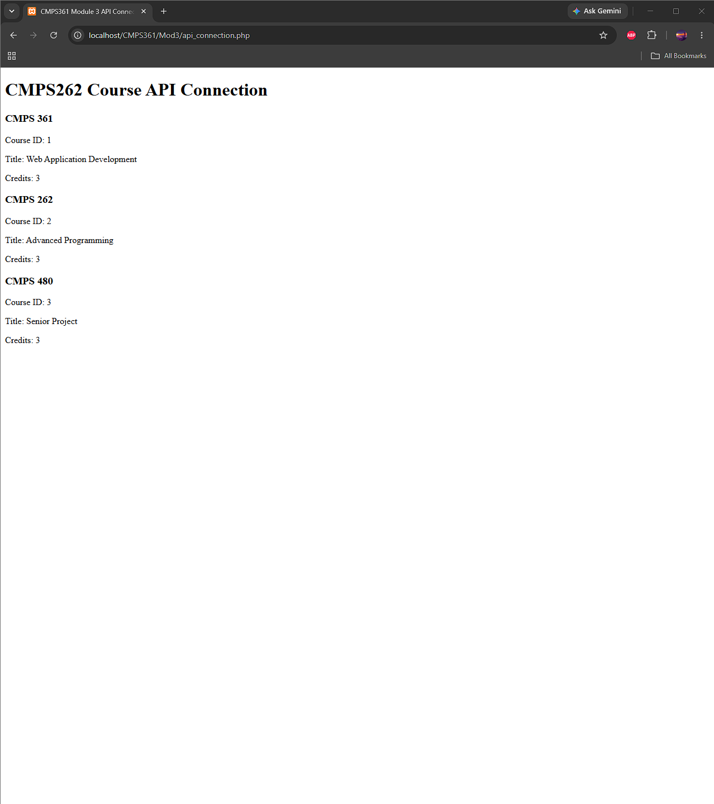

# CMPS 361 - Module 3

## PostgreSQL Connection

For this module, I worked on resolving the PostgreSQL connection issue with PHP.

I enabled the `pdo_pgsql` and `pgsql` extensions in XAMPP and installed PostgreSQL. I then created a test database called `cmps361_test` and successfully connected to it using PHP.

## API Connection

I created a simple local course API using Node.js and Express to test an API connection.

The API runs locally on port 3000 and returns course information as JSON.

My PHP file connects to the API, retrieves the data, and displays the course information in the browser.

## Results

The image below shows the API connection working successfully.

